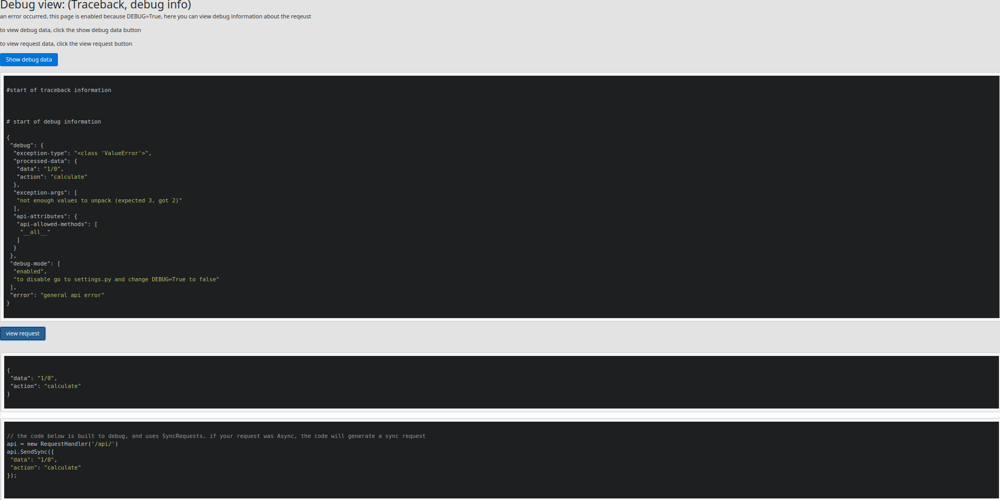

Debugger
========

The debugger will automatically catch exception on debug mode, and will create a debug url.

then it will redirect the client to the url and produce an error message.

it will also build the javascript code that caused this exception

Screenshot
^^^^^^^^^^

click the image to expand

